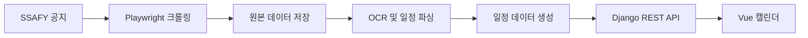
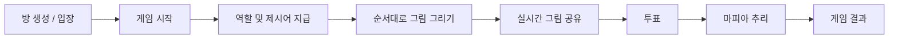

## 🍀

  

<!--  -->
<!-- | Language |  | -->

<table align="center">
  <tr>
    <td align="center">
      
    </td>
    <td>
      
    </td>
  </tr>
</table>

---

### 안녕하세요😊  
매일 성장하는 거북이🐢 같은 개발자 신수지입니다!

단순한 기능 구현을 넘어
사용자가 한 번 더 고민하지 않게 만드는 개발을 좋아합니다

---

## 🚀 기술 스택

| 카테고리 | 기술 |
|---|---|
| Frontend (Learning) |     |
| Backend (Learning) |   |
| Dev Tools |     |

---

## 💻 프로젝트

### 📅 inSSa — SSAFY 일정 관리 및 AI 어시스턴트

> 여러  이미지 공지에 흩어진 SSAFY 일정을
> **자동으로 수집·분석하여 캘린더로 제공하는 서비스**입니다.

  
  
  
  

<b>프로젝트 상세 내용</b>

#### 담당 영역

* 캘린더, 공지 목록·상세, 메인 대시보드 UI 구현
* Vue 3와 TypeScript 기반 프론트엔드 구조 설계
* 일정 및 공지 Django API 연동
* Playwright 기반 SSAFY 공지 데이터 수집
* OCR 결과와 일정 데이터 연결

#### 데이터 처리 구조

#### 주요 문제 해결

##### 1. 공지 일정을 캘린더에 정확히 표시하기

SSAFY 공지에는 하나의 게시글 안에 여러 날짜와 일정이 포함되어 있거나 서로 다른 공지에 같은 일정이 반복해서 작성되는 경우가 있었습니다.

공지에 적힌 날짜와 일정 내용을 기준으로 각각의 일정을 캘린더에 표시하고 여러 공지에서 동일한 일정이 확인되면 하나만 남도록 중복을 정리했습니다.

또한 이름이 비슷하더라도 날짜나 내용이 다른 일정은 서로 다른 일정으로 구분해 관리했습니다.

* 공지에 작성된 날짜를 기준으로 캘린더 일정 생성
* 하나의 공지에 여러 일정이 있으면 각각 분리해 표시
* 서로 다른 공지에 포함된 동일 일정은 중복 제거
* 제목이 비슷해도 날짜나 내용이 다르면 별도 일정으로 관리
* 여러 날짜에 걸친 일정은 해당 기간 전체에 표시

##### 2. 로그인 후 공지가 사라지는 문제

트랙 정보가 없는 공지가 로그인 사용자의 트랙 필터에서 제외되어 대부분의 공지가 보이지 않는 문제가 있었습니다.

* 명시된 공통 공지 여부를 우선 확인
* 트랙 정보가 있으면 해당 트랙으로 분류
* 정보가 없으면 공지 제목에서 트랙을 추론
* 추론할 수 없는 공지는 공통 공지로 처리
* 프론트엔드 기본 필터를 전체 트랙으로 변경

#### 개발하면서 중요하게 생각한 것

* **데이터 신뢰성**
  일정 서비스에서는 화려한 UI보다 일정이 누락되거나 잘못 표시되지 않는 것을 우선했습니다.

* **사용자 흐름**
  사용자가 별도의 설명 없이도 검색, 필터링, 일정 확인을 자연스럽게 수행할 수 있도록 화면을 구성했습니다.

* **MVP에 맞는 구조**
  과도한 추상화와 라이브러리 도입을 피하고, 필요한 범위 안에서 단순하고 유지보수 가능한 구조를 선택했습니다.

#### 프로젝트를 통해 배운 점

크롤링으로 공지를 수집하고 원본 데이터 저장과 OCR·일정 파싱을 거쳐 캘린더에 표시하기까지의 전체 데이터 처리 흐름을 경험했습니다.

또한 AI 코딩 도구를 사용할 때도 작업 범위, 기존 구조, API 사용 방식과 검증 기준을 명확히 전달해야 일관된 결과를 얻을 수 있다는 점을 배웠습니다.

### 🎨 Draw Mafia — 실시간 멀티플레이 그림 마피아 게임

> AI 코딩 도구(Copilot)를 활용하여 기획부터 구현까지 진행한
> **실시간 멀티플레이 그림 마피아 웹 게임**입니다.

  
  
  
  

<b>프로젝트 상세 내용</b>

#### 주요 구현 내용

* 게임 기획 및 전체 UI/UX 설계
* Next.js · React · TypeScript 기반 프론트엔드 구현
* Firebase Firestore를 활용한 실시간 멀티플레이 기능 구현
* Canvas 기반 실시간 그림판 구현
* AI(Copilot)를 활용한 바이브 코딩 및 프로젝트 구조 설계

---

#### 게임 진행 구조

---

#### 주요 문제 해결

##### 1. 제시어 생성 방식 개선

행동과 피사체를 단순 랜덤으로 조합했더니
'먹는 고양이', '마시는 강아지'처럼 어색한 제시어가 생성되는 문제가 있었습니다.

또한 시민과 마피아의 행동이 항상 동일하여 게임 패턴이 쉽게 드러났습니다.

이를 해결하기 위해

* 카테고리 기반 제시어 구성
* 자연스러운 행동-피사체 조합만 생성
* 시민과 마피아의 행동을 동일/유사/다르게 확률 분기

하도록 개선하여 게임의 자연스러움과 난이도를 높였습니다.

---

##### 2. 실시간 게임과 턴제 구조 동시 구현

모든 플레이어가 그림을 실시간으로 확인하면서도
현재 턴 플레이어만 그림을 그릴 수 있어야 했습니다.

이를 위해

* 현재 턴 플레이어만 입력 권한 부여
* 그림은 모든 플레이어에게 실시간 동기화
* 턴 종료 후 그림 저장

구조를 적용하여
실시간성과 턴제 진행을 동시에 만족하도록 구현했습니다.

---

#### 개발하면서 중요하게 생각한 것

* **게임 밸런스**
  단순히 기능이 동작하는 것이 아니라 마피아와 시민 모두에게 적절한 난이도를 제공하는 것을 우선했습니다.

* **실시간 사용자 경험**
  실시간 동기화와 턴제 진행이 자연스럽게 이어질 수 있도록 UI와 게임 흐름을 설계했습니다.

* **AI 활용 능력**
  AI가 생성한 코드를 그대로 사용하는 것이 아니라, 문제를 정의하고 요구사항을 구체화하며 프로젝트 방향을 설계하는 데 집중했습니다.

---

#### 프로젝트를 통해 배운 점

AI 코딩 도구를 활용하더라도
프로젝트의 방향과 요구사항을 명확하게 정의하는 능력이 가장 중요하다는 것을 느꼈습니다.

또한 실시간 동기화, 상태 관리, 게임 UX를 직접 설계하며
단순 기능 구현보다 사용자 경험과 게임 흐름을 설계하는 과정의 중요성을 배울 수 있었습니다.

---

## 📜 자격증

- 정보처리기능사
- 정보처리산업기사

---

  
  <!-- 
    
  -->

